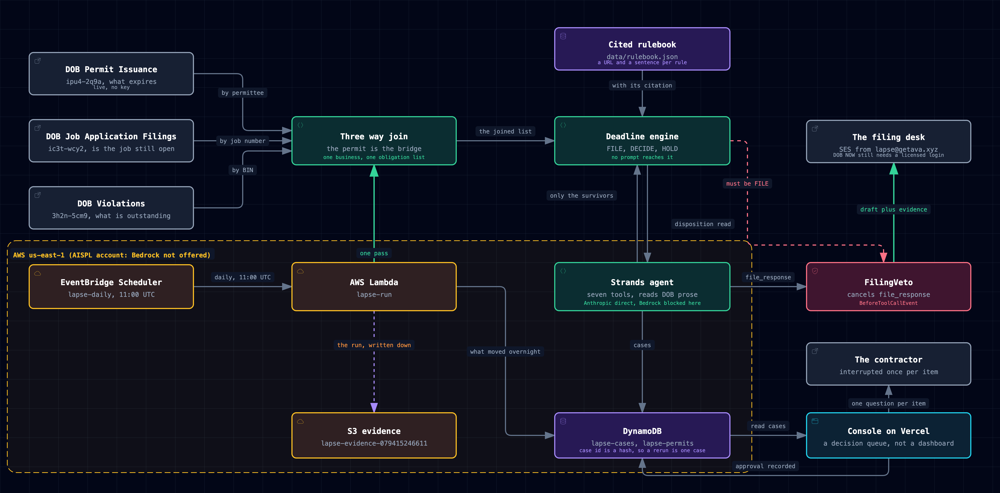

# Lapse

An agent that watches a New York City contractor's permits and violations, works out what is about to lapse, writes the renewal or the correction response, and interrupts them exactly once per item, when the decision is actually theirs.

## The problem, measured against the city's own data

Run `.venv/bin/python -m scripts.measure`. On 2026-09-14, against live NYC Open Data:

**605** DOB work permits carried an ISSUED status and an expiry date that fell in the previous thirty days, 2026-08-15 to 2026-09-13.

```
$where=expiration_date in (<the 30 days 2026-08-15..2026-09-13>) AND permit_status='ISSUED'
```

That number is too big, because the permit feed holds one row per issuance and a permit renewed four times looks like four permits. Collapse the renewal sequences onto the permit they renew and **542** are left. Then join each one to its job filing in a second dataset and ask whether DOB ever signed that job off. **463** had not been signed off or completed.

Four hundred and sixty three permits went past their date last month on jobs that were still open. Another **158** expire in the next seven days.

A permit does not fail loudly. It expires. Nobody calls. The date passes, the permit lapses, and the next thing that happens is an inspector at the site, a stop work order, and a re-file that costs weeks. The failure mode of this entire domain is silence.

On the violations side, **165,001** DOB violations issued since 2021-09-14 are still categorised ACTIVE. **581** of those carry a sentence a clerk typed into a free text field that says something about disposition, and seven of those say things a keyword list will never understand.

## What Lapse does

It reads three NYC datasets, no key, no auth, and joins them on the permit record, which is the only thing that touches all three:

| dataset | what it answers | key |
|---|---|---|
| DOB Permit Issuance [`ipu4-2q9a`](https://data.cityofnewyork.us/d/ipu4-2q9a) | what expires and when | permittee business name |
| DOB Job Application Filings [`ic3t-wcy2`](https://data.cityofnewyork.us/d/ic3t-wcy2) | whether the job is even open, and what the work is | job number |
| DOB Violations [`3h2n-5cm9`](https://data.cityofnewyork.us/d/3h2n-5cm9) | what is outstanding at the same building | BIN |

Nothing in NYC Open Data answers "what does this business have to do this month". The three datasets are keyed differently on purpose. A permit names its BIN and its job number, so walking the permit list once turns a business name into a set of buildings, and the set of buildings turns into violations that nobody attached to the contractor because the city does not attach them to contractors.

## The one idea

**The model reads free text and writes drafts. The model never decides whether anything is due.**

`agent/engine/deadline.py` decides, and no prompt reaches it. It returns one of three things:

| outcome | meaning | what the contractor sees |
|---|---|---|
| `FILE` | every check passed and the rulebook names one specific filing | the drafted response, and one Approve button |
| `DECIDE` | the arithmetic is sound but a fact only they hold changes which action is right | one question, and no send button |
| `HOLD` | nothing is due, or the item is already closed | nothing, ever |

and one of four deadline classes, on a single axis of days remaining: `lapsed`, `critical` (inside a week), `due` (inside a month), `clear`.

`HOLD` is the common case and the product depends on it. A contractor told about everything in their portfolio reads nothing, and then the one that mattered goes past too. Every `HOLD` is a notification that was correctly not sent, and there is a test that fails if the engine ever starts surfacing more than 40 percent of a portfolio.

## The three checks that make it credible

These are why the engine can be quiet without being wrong.

**Supersession.** `permit_sequence__` increments on every renewal and the old rows stay. A reader that treats each row as a live permit reports three emergencies that were handled months ago. Lapse collapses rows onto `(job, job doc, permit type)`, keeps the highest sequence, and every superseded row carries `superseded_by` so the verdict can say "this looks expired and it is, and sequence 09 already replaced it".

**Job status.** The permit feed cannot tell an expired permit on a live site from an expired permit on a job that closed two years ago. The filings feed can: `job_status` X is SIGNED OFF and U is COMPLETED. A lapsed permit on a closed job is paperwork. A lapsed permit on an open job is unpermitted work. That join is the difference between an alarm and noise.

**Whose obligation it is.** A violation attaches to a building, and for the periodic filing classes the city names the owner, not whoever happens to hold a permit there. Admin Code 28-303.7: "The owner shall file a signed annual report". So a plumbing contractor does not get handed the building's annual boiler filings. On the portfolio below that check alone holds back 87 items that a naive BIN join would have dumped in their queue.

## The rulebook is data, and every rule carries its source

`data/rulebook.json`. Every deadline this program acts on carries the URL it was read from and the sentence it was read out of.

```json
{
  "key": "PL",
  "label": "Plumbing permit",
  "action": "Renew it in the system it was issued in, DOB NOW: Build or eFiling, before the expiry date...",
  "artifact": "DOB NOW: Build or eFiling permit renewal, PW2 if anything changed, $130 renewal fee",
  "grace_days": 730,
  "lapsed_question": "Was any plumbing work done on this site after the permit expired? ...",
  "citation": "https://www.nyc.gov/site/buildings/property-or-business-owner/permit-renewal.page",
  "quote": "Permit renewals are issued on active permits and permits that have expired but have activity on the application within a two-year period of the permit expiration date..."
}
```

`tests/test_rulebook.py` fails the build on any rule whose citation is not an https URL at nyc.gov or the city's code publisher, or whose quote is too short to be a sentence a reader could find on that page. Adding an uncited rule breaks the suite. That is the point.

Where the city publishes a cure path but no deadline, `window_days` is `null` and the engine refuses to invent one: the item goes to `DECIDE` with the clock handed back to the contractor. Two published NYC sources genuinely disagree about the permit renewal window, one anchored to issuance and one to expiry. Both are recorded in `meta.known_conflicts` and a test fails if they are deleted. Silently picking one and writing it into an engine is how a wrong number survives a rewrite.

## Why a lapsed permit is a question and not a filing

This is the rule that decides the shape of the product, and it is the city's, not mine.

1 RCNY 102-04(a)(2) bars the renewal of a lapsed permit until the unpermitted work penalty is paid. 1 RCNY 102-04(d)(6) waives that penalty "Where a permit ... expired and no work was performed after the permit's expiration". Whether anybody worked on that site after the date passed is a fact that exists only on the site. No dataset holds it.

So the engine stops and asks one question, and the question is worth answering: if nothing was done it is a clean renewal, and if work continued the penalty is $600 on a one or two family dwelling and $6,000 on anything else, and it has to clear before the renewal will be issued at all.

That is what "interrupts them exactly once, when the decision is genuinely theirs" means here. It is not a design preference. It is where the city put the fork.

## What the model is actually for

A keyword list already handles most of DOB's closure language, and I measured exactly how much. Of the 581 ACTIVE violations carrying a disposition comment, the shallow check in `outstanding_by_text` correctly calls **574** of them closed. It leaves **7** open. Run `.venv/bin/python -m scripts.measure_prose`:

```
000810 PAID INVOICE 90876458
000810 PAID INVOICE 90876457
CHALLENGE APPROVED
000810 PAID INVOICE 90888813
```

Seven is a small number and I am not going to dress it up. It is also the only number that matters, because every one of those is a violation the city still lists as ACTIVE where the contractor has already paid the invoice or already won the challenge. Acting on one means paying twice, or re-curing something DOB already approved. No keyword list gets there. A reader gets there instantly.

That is the whole job description: `read_disposition` takes the model's honest read of DOB's prose and returns the verdict computed from it, so the model learns the outcome rather than choosing it. On permits there is no prose at all, so there is nothing for a model to be better at than a date comparison, and the engine is total. The model's work on a permit is the draft, written from the job description the architect filed:

> Job 104213922/03 permit PL seq 04 at 240 SECOND AVENUE, MANHATTAN expires September 15, 2026. The work is to provide new steam convector, remove and reinstall split AC unit condensers in cellar, replace four area drains, one floor drain, duplex sump pump, and house trap in cellar. Renew this plumbing permit in the system it was issued in, DOB NOW: Build or eFiling, before the expiry date.

A renewal request written from `job_type=A2, permit_type=PL, work_type=OT` is unreadable. That one reads like a filing agent wrote it.

## The two things that stop it sending

**`FilingVeto`**, a Strands `BeforeToolCallEvent` hook in `agent/lapse_agent.py`, cancels `file_response` unless the ledger holds a `FILE` verdict, an item that is still open, and a written draft for that exact case. Openness is re-read at send time off the verdict currently in the ledger, never remembered from when the case was opened.

**`approval_gate`**, a Strands `HumanInTheLoop` intervention with `allowed_tools=["*", "!file_response"]`, so that one tool always requires a person even if a caller has trusted everything else in the session. In a scheduled run nobody is at a terminal, so the gate does not block: it marks the case `awaiting_approval` and the pass moves on.

Approval is permission to send something that already passed every check. It is never permission to skip the checking, and `tests/test_veto.py::test_the_hook_cancels_a_filing_that_is_actually_attempted` approves a case first and then asserts the veto still refuses it.

Lapse cannot file anything with the city and never implies otherwise. DOB NOW takes a filing from a licensed person under their own login and nothing else. What Lapse produces is the text and the evidence for that filing, ready to go.

## The portfolio

`VARSITY PLBG AND HTG INC`, a real plumbing contractor, and these are their real public DOB filings. Nothing here is invented, because a made-up portfolio would have proved nothing: the failures this engine exists to prevent are all shaped like a real record that a naive reader mistakes for something else.

One pass, `.venv/bin/python -m agent.run --engine-only`:

```
permits screened     140      across 118 addresses in all five boroughs
violations screened   95      at the buildings where a live permit sits
items screened       235
held                 179      correctly silent
FILE                  16      drafted, waiting for one approval
DECIDE                40      one question each
classes              lapsed 31, critical 4, due 12, clear 80
```

Every one of the 179 held names the check that held it:

```
 87  contractor_is_respondent   the building owner's filing obligation, not this contractor's
 80  within_action_window       not due for more than thirty days
  9  job_open                   DOB signed the job off, so the expiry date is paperwork
  3  not_superseded             a later sequence already renewed this permit
```

Those 99 that are not simply "not due yet" are the ones a naive BIN-and-expiry join would have put in front of a person. All five boroughs, 118 addresses.

Then the full pass, `.venv/bin/python -m agent.run --live --dynamo`, with the model on every one of the 56 the engine did not settle:

```
{"event": "run_finished", "permits_screened": 140, "violations_screened": 95,
 "items_screened": 235, "held": 179, "engine_file": 16, "engine_decide": 40,
 "considered": 56, "cases_opened": 56, "drafted": 16, "awaiting_approval": 16,
 "needs_decision": 40, "filed": 0, "vetoed": 0, "source": "live NYC Open Data"}
```

`filed: 0` is the correct outcome of an unattended run. Sixteen responses are written and waiting for one person to press one button. Nothing left the building on its own.

Then one person approves one of them, `--only 3993569 --approve c0eb0cf5d8de4e11`, and the same pass runs again against that single item:

```
Tool #1: check_permit    permit job 500871103/02 permit PL seq 08: FILE (6 checks passed, 0 failed)
Tool #2: open_case       c0eb0cf5d8de4e11 awaiting_approval -> dynamodb://lapse-cases/...
Tool #3: draft_response  c0eb0cf5d8de4e11 cites 500871103
Tool #4: file_response   {"event": "approved", "detail": "c0eb0cf5d8de4e11 was approved by the contractor"}
                         {"event": "filed", "detail": "c0eb0cf5d8de4e11 -> lapse@getava.xyz [direct]"}
```

Thirteen seconds, one real SES send in `direct` mode with a real MessageId on the case record. The veto ran underneath the approval and had nothing to object to, which is the only circumstance in which anything is ever sent.

## Running it

```bash
python3.12 -m venv .venv && .venv/bin/pip install -e '.[dev]'

# the deterministic pass, no model, no credentials, captured data
.venv/bin/python -m agent.run --engine-only

# the same thing against NYC Open Data right now
.venv/bin/python -m agent.run --engine-only --live

# the full pass with the agent, drafts and all
.venv/bin/python -m agent.run --live --dynamo

# the suite, from a clean shell with nothing in the environment
env -i PATH="$PATH" HOME="$HOME" .venv/bin/python -m pytest tests -q
```

Everything in `data/` is a real Socrata response captured by `scripts/capture.py` and stamped with the `$where` that produced it. The suite reads those, never a fixture written to make a parser look right, so a schema change at the city's end shows up as a failure rather than as a silently empty portfolio.

### Proving the suite can fail

A guardrail that has only ever been tested by code that agrees with it has not been tested. Break the veto and the suite has to notice. From a clean clone, change one line in `FilingVeto.inspect`:

```python
        refusal = self.ledger.may_file(cid)
-       if refusal:
+       if False:
```

```
=== RED ===
FAILED tests/test_veto.py::test_the_hook_cancels_a_filing_that_is_actually_attempted
1 failed, 161 passed, 1 skipped, 2 deselected

=== GREEN, after git checkout -- agent/lapse_agent.py ===
162 passed, 1 skipped, 2 deselected
```

The test that goes red approves the case first, then calls `file_response` on a permit whose job DOB already signed off. With the hook, it is refused. Without it, a contractor gets told to renew a permit on a job that closed.

The blind spot worth stating: the fast suite proves the hook refuses. It does not prove the model would decline on its own, which is a different question and is covered by `tests/test_veto.py::test_the_model_will_not_file_a_response_it_was_ordered_to_file` under `-m live`, where the real model is instructed to file anyway and does not.

## Architecture

Strands Agents SDK, model-agnostic, running on Anthropic `claude-sonnet-4-5-20250929`. Bedrock and AgentCore are not available on this AWS account, which is an AWS India (AISPL) account where every model in every region returns `Operation not allowed`. Strands being model-agnostic is what made that a configuration line rather than a dead end, and the rest of AWS carries the load:

- **Lambda** `lapse-run`, one unattended pass
- **EventBridge Scheduler** `lapse-daily`
- **DynamoDB** `lapse-cases` (PK `contractor`, SK `case_id`), `lapse-permits` for last-seen state so a pass can tell what moved
- **S3** `lapse-evidence-079415246611`
- **SES** from `lapse@getava.xyz`, with the delivery mode recorded honestly on every case
- **CloudWatch** for the run log



See `docs/architecture.html` for the interactive version with its three views, and `docs/RECORD.md` for the case record contract that `agent/`, `infra/` and `console/` all write and read.

## The console

**[lapse-console.vercel.app](https://lapse-console.vercel.app)**

A decision queue, not a dashboard. One route, cards sorted by `verdict.days_remaining` ascending, one action per card. A card `awaiting_approval` shows the whole draft and one button. A card `needs_decision` shows the one question and has no send affordance at all. Every card carries the rule's citation, the BIS link for the record, the dataset it was read from, and the evidence id of the exact decision it rests on, because a deadline a contractor cannot check is a deadline they have no reason to believe.

The healthy state is empty, and it says so in a way that does not look broken. There is a separate state for the table being missing, which says "This page is not saying you are clear", because an empty render and a broken read look identical and only one of them is good news.

## Licence

MIT.
